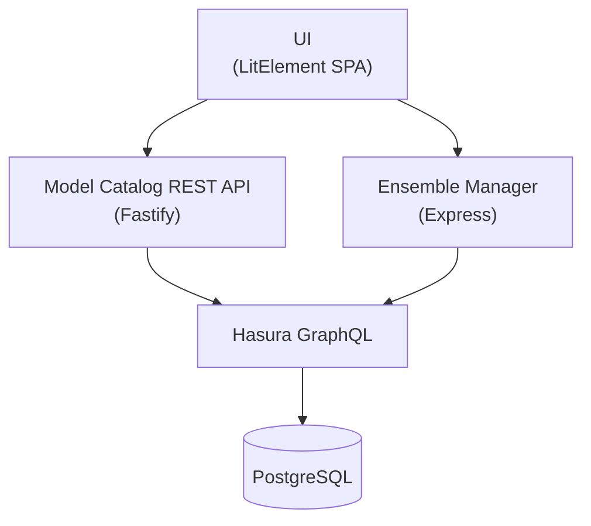
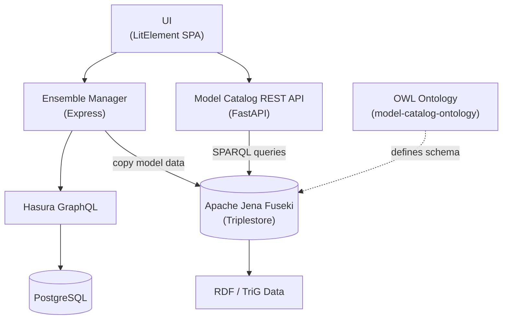

# MINT - Model INTegration

## Submodule Status

| Submodule | Build | Last Commit |
|-----------|-------|-------------|
| [model-catalog-api](https://github.com/mintproject/model-catalog-api) | [](https://github.com/mintproject/model-catalog-api/actions/workflows/ci.yml) |  |
| [mint-ensemble-manager](https://github.com/mintproject/mint-ensemble-manager) | [](https://github.com/mintproject/mint-ensemble-manager/actions/workflows/docker-publish.yml) |  |
| [mint-ui-lit](https://github.com/mintproject/mint-ui-lit) | [](https://github.com/mintproject/mint-ui-lit/actions/workflows/docker-publish.yml) |  |
| [graphql_engine](https://github.com/mintproject/graphql_engine) | [](https://github.com/mintproject/graphql_engine/actions/workflows/docker-publish.yml) |  |
| [helm-charts (mint)](https://github.com/mintproject/mint) | [](https://github.com/mintproject/mint/actions/workflows/linter.yaml) [](https://github.com/mintproject/mint/actions/workflows/docs.yaml) |  |
| [MINT_USERGUIDE](https://github.com/mintproject/MINT_USERGUIDE) | [](https://github.com/mintproject/MINT_USERGUIDE/actions/workflows/pages/pages-build-deployment) |  |
| [model-catalog-fetch-api-client](https://github.com/mintproject/model-catalog-fetch-api-client) | _no CI_ |  |
| [Mint-ModelCatalog-Ontology](https://github.com/mintproject/Mint-ModelCatalog-Ontology) | _no CI_ |  |

MINT is a scientific modeling platform that enables researchers to discover, configure, and execute computational models. It provides a unified catalog of models, datasets, and variables, allowing scientists to set up and run model ensembles for complex scenarios such as climate impact analysis, hydrology, and agriculture.

## Goals

- **Model Discovery:** Provide a searchable catalog of scientific models with rich metadata describing inputs, outputs, parameters, and supported regions/time periods.
- **Model Composition:** Enable researchers to connect models across disciplines (e.g., linking a climate model's output to an agriculture model's input) through shared standard variables.
- **Execution Orchestration:** Manage the configuration and execution of model runs, including ensemble runs with varying parameter sets.
- **Reproducibility:** Capture the full provenance of model setups -- software versions, configurations, input datasets, and parameters -- so experiments can be reproduced and shared.

## Architecture

### Current Architecture (v2.0)

The platform follows a layered architecture backed by a single PostgreSQL database, exposed via GraphQL and REST APIs:



**Data flow:** Scientific model metadata is stored in PostgreSQL, exposed through Hasura GraphQL, and served to clients via a REST API that conforms to an OpenAPI specification. The ETL pipeline handles data migration from the legacy RDF triplestore into the relational database.

### Legacy Architecture (v1.x)

The original architecture used an RDF triplestore (Apache Jena Fuseki) as the data backend, with a Python-based REST API that issued SPARQL queries directly. The Ensemble Manager copied model data from Fuseki into its own Hasura/PostgreSQL database for execution, creating data duplication and potential sync issues between the two stores.



**Data flow:** Model metadata was authored as RDF (TriG format), loaded into Apache Jena Fuseki, and queried via SPARQL by the FastAPI-based REST API. The OWL ontology (`model-catalog-ontology/`) defined the schema for all model catalog entities. This architecture was replaced in v2.0 by the PostgreSQL + Hasura stack via an ETL migration pipeline.

## Repository Structure

This monorepo uses git submodules for major components:

| Directory | Description | Stack |
|-----------|-------------|-------|
| `model-catalog-api/` | REST API v2.0.0 for the model catalog | TypeScript, Fastify |
| `mint-ensemble-manager/` | Model execution orchestration service | TypeScript, Express |
| `ui/` | Web frontend | TypeScript, LitElement |
| `graphql_engine/` | Hasura schema, migrations, and metadata | SQL, YAML |
| `etl/` | RDF-to-PostgreSQL migration pipeline | Python |
| `helm-charts/` | Kubernetes deployment charts | Helm |
| `model-catalog-ontology/` | OWL ontology defining the model catalog schema | OWL/RDF |
| `model-catalog-fetch-api-client/` | Generated API client library | TypeScript |
| `mint-instances/` | Preconfigured model instance data | - |
| `MINT_USERGUIDE/` | User documentation | MkDocs |
| `scripts/` | Deployment and maintenance utilities | Shell, SQL |

> **Note:** The `model-catalog-fastapi/` and `model-catalog-endpoint/` directories are legacy components from the old RDF/Fuseki-based architecture. They are no longer actively maintained and can be ignored. The platform now uses PostgreSQL with Hasura GraphQL as its data backend.

## Getting Started

### Prerequisites

- Node.js 18+
- Python 3.9+
- Docker (for running PostgreSQL and Hasura locally)

### Development

Each component can be developed independently. See the README in each submodule for detailed instructions.

```bash
# Clone with submodules
git clone --recurse-submodules https://github.com/mintproject/mint.git

# Model Catalog API
cd model-catalog-api
npm install && npm run dev

# UI
cd ui
yarn install && yarn start

# Ensemble Manager
cd mint-ensemble-manager
npm install && npm run start:watch
```

### Kubernetes Deployment

To deploy MINT on a Kubernetes cluster using Helm, see the [Helm Charts installation guide](helm-charts/README.md).

### Database Setup

```bash
# Apply Hasura migrations
cd graphql_engine
hasura migrate apply
hasura metadata apply

# Load data from RDF sources
python3 etl/run.py --trig-path model-catalog-endpoint/data/model-catalog.trig
```

## License

See individual submodule repositories for license information.
