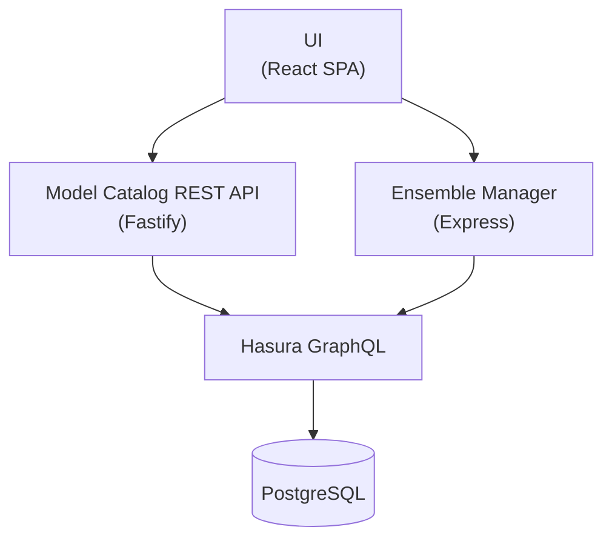
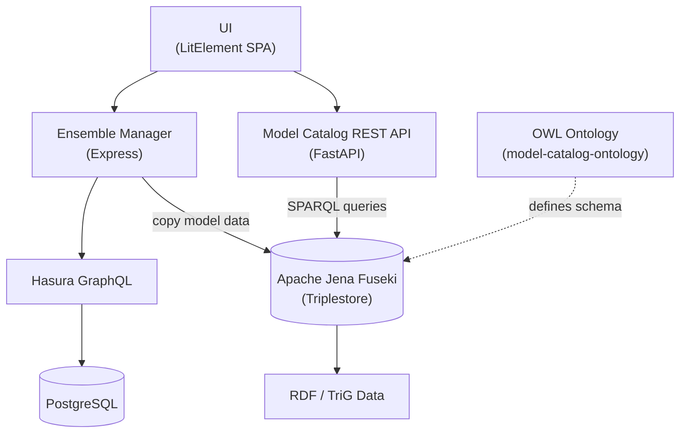

# MINT - Model INTegration


## Build Status

The four services build from this repository. This repository has no submodules. The
deprecated `ui` frontend and the MINT chart build from their own repositories.

The four service badges track `main`, the production branch. `develop` is the integration
branch — see `CLAUDE.md` § Branch model.

| Component | Build |
|-----------|-------|
| Model Catalog API | [](https://github.com/mintproject/monorepo/actions/workflows/model-catalog-api.yml) |
| Ensemble Manager | [](https://github.com/mintproject/monorepo/actions/workflows/mint-ensemble-manager.yml) |
| UI (React) | [](https://github.com/mintproject/monorepo/actions/workflows/ui-react.yml) |
| Hasura GraphQL engine | [](https://github.com/mintproject/monorepo/actions/workflows/graphql_engine.yml) |
| UI (LitElement, external repo [mint-ui-lit](https://github.com/mintproject/mint-ui-lit)) | [](https://github.com/mintproject/mint-ui-lit/actions/workflows/docker-publish.yml) |
| The MINT chart (external repo [mint](https://github.com/mintproject/mint)) | [](https://github.com/mintproject/mint/actions/workflows/linter.yaml) [](https://github.com/mintproject/mint/actions/workflows/docs.yaml) |

MINT is a scientific modeling platform that enables researchers to discover, configure, and execute computational models. It provides a unified catalog of models, datasets, and variables, allowing scientists to set up and run model ensembles for complex scenarios such as climate impact analysis, hydrology, and agriculture.

## Goals

- **Model Discovery:** Provide a searchable catalog of scientific models with rich metadata describing inputs, outputs, parameters, and supported regions/time periods.
- **Model Composition:** Enable researchers to connect models across disciplines (e.g., linking a climate model's output to an agriculture model's input) through shared standard variables.
- **Execution Orchestration:** Manage the configuration and execution of model runs, including ensemble runs with varying parameter sets.
- **Reproducibility:** Capture the full provenance of model setups -- software versions, configurations, input datasets, and parameters -- so experiments can be reproduced and shared.

## Architecture

### Current Architecture (v2.0)

The platform follows a layered architecture backed by a single PostgreSQL database, exposed via GraphQL and REST APIs:


```mermaid
graph TD
    UI["UI<br/>(React SPA)"]
    API["Model Catalog REST API<br/>(Fastify)"]
    EM["Ensemble Manager<br/>(Express)"]
    HASURA["Hasura GraphQL"]
    PG[("PostgreSQL")]

    UI --> API
    UI --> EM
    API --> HASURA
    EM --> HASURA
    HASURA --> PG
```

**Data flow:** Scientific model metadata is stored in PostgreSQL, exposed through Hasura GraphQL, and served to clients via a REST API that conforms to an OpenAPI specification. The ETL pipeline handles data migration from the legacy RDF triplestore into the relational database.

### Legacy Architecture (v1.x)

The original architecture used an RDF triplestore (Apache Jena Fuseki) as the data backend, with a Python-based REST API that issued SPARQL queries directly. The Ensemble Manager copied model data from Fuseki into its own Hasura/PostgreSQL database for execution, creating data duplication and potential sync issues between the two stores.


```mermaid
graph TD
    UI["UI<br/>(LitElement SPA)"]
    API["Model Catalog REST API<br/>(FastAPI)"]
    EM["Ensemble Manager<br/>(Express)"]
    FUSEKI[("Apache Jena Fuseki<br/>(Triplestore)")]
    RDF["RDF / TriG Data"]
    OWL["OWL Ontology<br/>(model-catalog-ontology)"]
    HASURA["Hasura GraphQL"]
    PG[("PostgreSQL")]

    UI --> API
    UI --> EM
    API -- "SPARQL queries" --> FUSEKI
    EM -- "copy model data" --> FUSEKI
    EM --> HASURA
    HASURA --> PG
    FUSEKI --> RDF
    OWL -. "defines schema" .-> FUSEKI
```

**Data flow:** Model metadata was authored as RDF (TriG format), loaded into Apache Jena Fuseki, and queried via SPARQL by the FastAPI-based REST API. The OWL ontology defined the schema for all model catalog entities. This architecture was replaced in v2.0 by the PostgreSQL + Hasura stack via an ETL migration pipeline.

## Repository Structure

The services live directly in this repository. It holds no submodules.

| Directory | Description | Stack |
|-----------|-------------|-------|
| `model-catalog-api/` | REST API v2.0.0 for the model catalog | TypeScript, Fastify |
| `mint-ensemble-manager/` | Model execution orchestration service | TypeScript, Express |
| `ui-react/` | Web frontend (current) | TypeScript, React, Vite |
| `graphql_engine/` | Hasura schema, migrations, and metadata | SQL, YAML |
| `etl/` | One-time RDF-to-PostgreSQL migration. Complete | Python |
| `knowledge-base/` | MINT domain wiki | Markdown |
| `docs/` | Architecture decisions, runbooks, agent guides | Markdown |
| `scripts/` | Deployment and maintenance utilities | Shell, SQL |
| `backups/` | Committed PostgreSQL dump (23 MB) | SQL |

Two things MINT deploys are not in this repository. Read them where they live:

- **The MINT chart** — [`mintproject/mint`](https://github.com/mintproject/mint). It is a
  published Helm repository at `https://mintproject.github.io/mint`, and it has external
  consumers. Install it from there, not from a clone.
- **`ui`**, the deprecated LitElement frontend —
  [`mintproject/mint-ui-lit`](https://github.com/mintproject/mint-ui-lit). It is being
  removed from TACC by [#81](https://github.com/mintproject/monorepo/issues/81).

> **Four repositories left this checkout in the single-repo cutover**
> ([#146](https://github.com/mintproject/monorepo/issues/146)):
> `model-catalog-ontology/`, `MINT_USERGUIDE/`, `model-catalog-fetch-api-client/` and
> `dynamo-experiment-may/`. Two stay maintained in their own repositories:
>
> - The OWL ontology for the model catalog schema:
>   [`mintproject/Mint-ModelCatalog-Ontology`](https://github.com/mintproject/Mint-ModelCatalog-Ontology)
> - The user documentation:
>   [`mintproject/MINT_USERGUIDE`](https://github.com/mintproject/MINT_USERGUIDE)
>
> `model-catalog-fastapi` (legacy REST API v1.8.0) and `model-catalog-endpoint` (the
> Fuseki triplestore) belong to the v1.x architecture. `model-catalog-fastapi` is
> archived. `model-catalog-endpoint` stays live: it holds the TriG source file.

## Getting Started

### Prerequisites

- Node.js 18+
- Python 3.9+
- Docker (for running PostgreSQL and Hasura locally)

### Run the whole platform on a laptop

`docker compose up` starts every service on one machine, with Tapis
authentication and a demo model catalog. **[`compose/README.md`](compose/README.md)
is the guide.**

```bash
docker compose up -d --wait
cp compose/ui-react.env ui-react/.env
cd ui-react && npm install && npm run config:local && npm run dev
```

Then open `http://localhost:3000`.

### Development

Each component can be developed independently. See the README in each directory for detailed instructions.

```bash
git clone https://github.com/mintproject/monorepo.git

# Model Catalog API
cd model-catalog-api
npm install && npm run dev

# UI
cd ui-react
npm install && npm run dev

# Ensemble Manager
cd mint-ensemble-manager
npm install && npm run start:watch
```

A plain clone is complete. This repository has no submodules, so `--recurse-submodules`
does nothing.

### Kubernetes Deployment

The MINT chart deploys the platform. It is published as a Helm repository:

```bash
helm repo add mintproject https://mintproject.github.io/mint
helm install mint mintproject/MINT -n mint --create-namespace
```

For the chart source and its installation guide, see
[`mintproject/mint`](https://github.com/mintproject/mint).

### Database Setup

```bash
# Apply Hasura migrations
cd graphql_engine
hasura migrate apply
hasura metadata apply

# Seed the catalog. This is the one-time RDF migration; the v2.0 platform does not
# run it. The TriG file is not in this repository. Download it from
# mintproject/model-catalog-endpoint at data/model-catalog.trig. See etl/README.md.
python3 etl/run.py --trig-path <path>/model-catalog.trig
```

## License

[MIT](https://opensource.org/license/mit). See [LICENSE](LICENSE).

The four services carry the same license. Each service directory holds its own copy:

| Service | License file |
|---------|--------------|
| Model Catalog API | [`model-catalog-api/LICENSE`](model-catalog-api/LICENSE) |
| Ensemble Manager | [`mint-ensemble-manager/LICENSE`](mint-ensemble-manager/LICENSE) |
| UI (React) | [`ui-react/LICENSE`](ui-react/LICENSE) |
| Hasura GraphQL engine | [`graphql_engine/LICENSE`](graphql_engine/LICENSE) |
